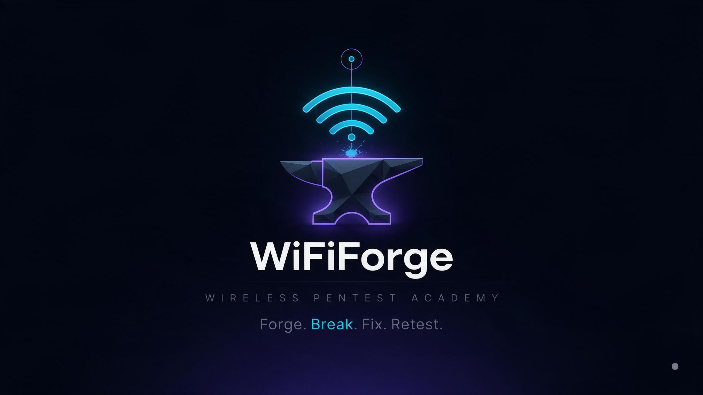

<p align="center">
  
</p>

<h1 align="center">SecCraft</h1>
<p align="center"><strong>Hands-on Cybersecurity Learning Platform</strong><br />
Learn. Practice. Investigate. Improve.<br />
<sub>Learn cybersecurity by doing.</sub></p>

<p align="center">
  <a href="https://amitpal-cyberbuddy.github.io/SecCraft/"></a>
  
  
  
</p>

> **Pages address:** [amitpal-cyberbuddy.github.io/SecCraft](https://amitpal-cyberbuddy.github.io/SecCraft/). GitHub Pages is configured for GitHub Actions; the site is served after a successful deployment from `main`.

## What it is

SecCraft is a local-first platform for learning cybersecurity through practical, evidence-led assessment. Learners investigate a system, choose and run tests, record what the evidence supports, assess impact, recommend remediation, retest, and report. The platform is broader than its first available learning path: Wireless Pentesting.

Guest learning is the default: authored content, local progress, and the offline-capable PWA remain usable without an account. Optional hosted accounts use Supabase Auth, FastAPI `/api/v1`, and PostgreSQL; the API supports email verification, owner approval, account-scoped progress sync/import, and owner controls. Account services require deployment configuration and are disabled by default. Local XP and practice records are not server-verified credentials; see [`docs/ACCOUNT_SYNC_PLATFORM.md`](docs/ACCOUNT_SYNC_PLATFORM.md) for setup, trust boundaries, limitations, and the production checklist.

## What is included

**Wireless Pentesting — the currently available path**

- 20 modules across 6 phases, with 27 authored lessons
- 20 labs, including 16 verified capture artifacts
- 15 challenges with 45 tasks, plus 35 decision scenarios
- A 42-item engagement checklist and the `ENG-01` assessment pack
- Reference material, evidence collection, reporting, CVSS calculation, and printable local completion records

**Platform shell**

- 8 learning paths are represented in the catalogue: 1 available and 7 planned
- Path-aware learning, labs, challenges, analytics, and browser-local progress
- Search, keyboard shortcuts, theme preferences, and offline-capable static app shell
- Simulation, hybrid, and RF-required lab tiers are identified honestly; simulation labs require no wireless hardware

**Optional account platform (configuration required)**

- Supabase email/password Auth with server-side token and email-verification checks
- FastAPI `/api/v1`, PostgreSQL/Alembic, pending/active/rejected/suspended account states, and owner-only administration
- Generic account-scoped progress fetch and preview/merge import; imported records remain unverified and award no XP
- Assessment attempts are metadata-only/unverified. No server grader or server-issued certificate is claimed yet.

Counts above describe the content currently in the repository. The content catalogues under `frontend/src/content/` are the source of truth; totals displayed in the application are derived from those files.

## Quick start

Requirements: Node.js 20.19+ or 22.12+ for the frontend (Vite 8), and Python 3.11 for the optional API.

```bash
# Terminal 1 — frontend
cd frontend
npm ci
npm run dev
# Open http://localhost:3000/SecCraft/
```

```bash
# Terminal 2 — local API (SQLite guest/dev mode by default)
cd backend
python3 -m venv .venv
. .venv/bin/activate
pip install -r requirements.txt
uvicorn app.main:app --reload --host 0.0.0.0 --port 8000
```

Vite proxies same-origin `/api` requests to port 8000. Without provider/database configuration, account endpoints fail closed; public content and guest progress continue working. For Supabase Auth, PostgreSQL migrations, owner bootstrap, deployment, and external service configuration, follow [`docs/ACCOUNT_SYNC_PLATFORM.md`](docs/ACCOUNT_SYNC_PLATFORM.md).

To build and check the GitHub Pages sub-path locally:

```bash
cd frontend
npm ci
npm run build
npm run preview:pages
# Open http://localhost:4173/SecCraft/
```

## GitHub Pages and repository

- Repository: [AmitPal-CyberBuddy/SecCraft](https://github.com/AmitPal-CyberBuddy/SecCraft)
- Pages target: [https://amitpal-cyberbuddy.github.io/SecCraft/](https://amitpal-cyberbuddy.github.io/SecCraft/)
- Deployment workflow: [`.github/workflows/pages.yml`](.github/workflows/pages.yml), triggered from `main`
- GitHub Actions derives the deployed Vite base from the repository name; the local default is `/SecCraft/`.
- GitHub does **not** automatically redirect a renamed repository's old GitHub Pages URL. Update old bookmarks and external links to the canonical URL above; a legacy Pages redirect requires separate hosting/configuration.

See [`docs/GITHUB_PAGES.md`](docs/GITHUB_PAGES.md) for deployment checks, deep links, and troubleshooting.

## Architecture

```text
frontend/   Vite, React, TypeScript, Tailwind, Zustand, React Router; bundled content and PWA shell
backend/    FastAPI `/api/v1`, Supabase token verification, SQLAlchemy/Alembic, PostgreSQL in deployment; SQLite for local tests/dev
content/    Learning content and supporting datasets
scripts/    Artifact generation, verification, and local tooling
docs/       Product, learning-path, safety, account-sync, architecture, and deployment documentation
```

Guest learning is static-host friendly and uses no analytics or external font CDN. Account builds make requests only to explicitly configured Supabase/API origins; the generated CSP includes those origins and the build audits literal third-party requests. CI also verifies the generated lab artifacts.

## Safety and evidence

Use the labs only in a local lab or against systems for which you have explicit authorization. Simulation results do not prove radio-frequency behavior; hybrid and RF-required exercises state their hardware and evidence limits. Captures and challenge answers are checked by `scripts/verify-lab-artifacts.py` (206 checks in this revision).

For security reporting and project security claims, see [`SECURITY.md`](SECURITY.md). For lab boundaries, see [`docs/SIMULATION_VS_HARDWARE.md`](docs/SIMULATION_VS_HARDWARE.md).

## Current project details

- Product: **SecCraft — Hands-on Cybersecurity Learning Platform**
- Primary line: **Learn. Practice. Investigate. Improve.**
- Wireless path line: **Understand the Protocol. Test the Implementation.**
- Version: **2.1.0**
- Design: layered ink surfaces, cyan-teal learning cues, violet analysis accents, amber XP, self-hosted Inter Variable, and a native monospace stack for technical data; no remote fonts
- `WiFiForge` remains only in explicitly retained compatibility names/data, such as legacy storage keys, artifact tooling, and historical records. It is not the repository or platform name.

The active identity and migration record are retained for maintainers; superseded phase plans and unused assets have been removed. [`docs/BRANDING.md`](docs/BRANDING.md) and [`docs/BRANDING_MIGRATION.md`](docs/BRANDING_MIGRATION.md) describe the current identity and completed migration.

## License

This repository currently has no `LICENSE` file. Do not assume reuse terms; contact the repository owner before redistributing it.
