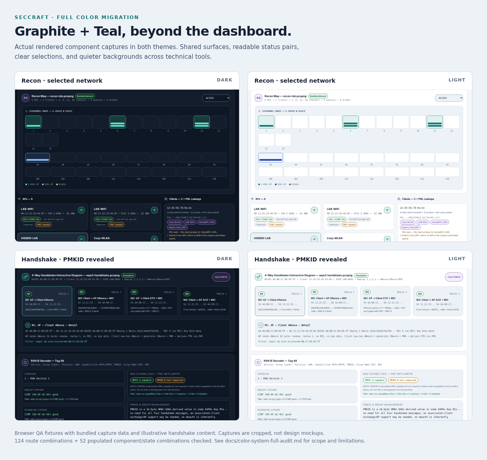

# Graphite + Teal — full source audit and migration

Completed 2026-10-01, following the approved [pilot](color-system-pilot.md).

## What changed

The source audit covered application TS/TSX, shared CSS, Tailwind configuration, inline colors, status/role mappings, diagrams, progress/data visuals, code highlighting, overlays and terminal surfaces. This completes the remaining source-color migration; it is not a claim that every possible application state has been accessibility-certified.

A reproducible inventory of literal hex and palette utilities (`text`, `bg`, `border`, gradient stops, `ring`, `divide`, `accent`, `fill`, `stroke`) found **2,347 uses across 55 TSX files after the pilot**. Those consumers now use semantic variables or shared action classes: **zero matching legacy color utilities remain in application TS/TSX**. These are migration counts, not 2,347 proven contrast failures.

- One graphite surface scale and primary/secondary/muted text hierarchy in both themes.
- Teal interactions; green success; amber warnings; red danger; blue information/data; purple owner/advanced-role accents. Existing status labels and icons remain; selected CVSS metrics and recon AP cards now expose pressed state.
- Opaque status surface/text pairs replace variable-opacity legacy tints. Decorative separators stay quiet; input and focus boundaries use stronger control tokens.
- Primary actions use paired foregrounds and explicit hover/pressed colors rather than purple/cyan gradients and brightness filters. Disabled primary actions retain readable labels on a neutral surface.
- Removed obsolete Tailwind brand palettes, duplicated base colors, and the large light-mode literal-utility `!important` remapping block. Shadows follow theme-aware elevation; removed full-card ambient glow layers.
- Migrated lab/handshake/configuration tools, packet inspector, recon charts, scoring, quizzes, flashcards, achievement/level UI, reference, report tools, local authoring, search/activity overlays, account components and secondary pages.
- Chart series have contrast-tested tokens. Recon's second series is blue with a written legend; channel groups have accessible counts. Literal dark transcript colors remain intentional and locally scoped, while surrounding terminal controls follow the selected theme.
- Source guard prevents new literal palette utilities and unresolved alpha-on-variable utilities. Tests cover accent/status backgrounds, foregrounds on solid status colors, and chart/control boundaries in both themes.

## Additional issues found in rendered states

- Network filter lacked an accessible name: added a stable name.
- Configuration issues and search suggestions could scroll without a keyboard target: added named, focusable regions.
- Activity drawer used `100vw` inside a viewport with a reserved scrollbar gutter: changed to containing-block width to prevent left-edge clipping.
- Long quiz answers could flex-shrink native radio controls to zero width on mobile: controls no longer shrink; accent is semantic.
- Flashcards and selectable AP cards were click-only: converted to buttons. Flashcard flip transitions respect reduced motion.
- A static **LIVE** recon badge appeared even for shipped capture files: it now says **API dataset** or **Bundled dataset**, without changing captured frames or inventing data. Also clear an old unavailable notice on a new load.

## Final validation

| Check | Result |
|---|---|
| Production TypeScript + Vite build | Passed, including type-checking dev fixtures |
| Frontend tests | **34 passed** |
| Lint | **0 errors; 78 warnings remain** |
| Git whitespace check | Passed |
| All 31 default audit routes × 320/1440 × dark/light | **124 combinations**, no detected page overflow, out-of-viewport content, runtime errors or axe violations |
| Populated component/state checks × 320/1440 × dark/light | **52 combinations**, no detected document overflow, runtime errors or axe violations |
| Mocked populated owner inbox | **4 combinations passed**, including stale-save preservation and review retry |
| Rendered action states | Default/hover/pressed, input border/focus, feedback error and selected report view passed in both themes |
| Keyboard smoke | Skip link, navigation/search focus return, theme changes, reset cancellation, landscape report view, 640px CSS reflow passed |
| Visual inspection | Actual light recon and dark mobile learning captures inspected; comparison below assembled from final captures |

The 52 component/state combinations comprise 13 checks at each width/theme: network/default and selected+filtered; tools/default and suggestions+PMKID+hint+terminal error; learning/default and revealed flashcard answer; authoring/default and added lesson+selected CVSS metric; search/default and populated keyboard-selected results; populated activity/default and read; submitted module quiz.



## Reproduce

Use Node compatible with `frontend/package.json` and a running Vite dev server on port 3000:

```sh
npm test --prefix frontend
npm run lint --prefix frontend
npm run build --prefix frontend
npm ci --prefix tools/browser-qa
tools/browser-qa/node_modules/.bin/playwright install --with-deps chromium
export UI_AUDIT_MODULES="$PWD/tools/browser-qa/node_modules"
UI_AUDIT_AXE=1 UI_AUDIT_WIDTHS=320,1440 node scripts/ui-responsive-audit.mjs
node scripts/ui-color-components-smoke.mjs
node scripts/ui-color-states-smoke.mjs
node scripts/ui-keyboard-smoke.mjs
node scripts/ui-feedback-owner-smoke.mjs
```

The component runner uses `frontend/tests/fixtures/color-audit.html`, a **dev-only HTML entry**, not an application route or production build input. It imports actual components, uses shipped capture artifacts, and seeds only local QA activity. API failures are explicitly intercepted. Results/screenshots default to `.cache/ui-audit`; keep them out of Git. `UI_AUDIT_OUTPUT`, `UI_AUDIT_URL` and `UI_AUDIT_EXECUTABLE` can override locations. CI now includes the component/state runner, but remote GitHub execution was not performed here.

## Intentional exceptions and limits

- Fixed dark terminal transcript; print/document-export colors; browser theme metadata; neutral shadows/scrims and tour mask are deliberate exceptions, not a second UI theme.
- Certificate issuance remains disabled. Its unavailable state was rendered; dormant certificate/export-document paths are not validated as issued credentials. PDF document rendering is separate from theme validation.
- API-unavailable and local-data fixtures do not prove live provider/backend authorization or all owner workflows. No backend/security behavior was changed for this color work.
- Default routes and representative populated interactions are covered, not every data permutation, every hover/focus target, every SVG pixel, every intermediate viewport or all assistive technologies. No physical-device, browser-chrome zoom, screenreader or comprehensive WCAG certification is claimed.
- Existing lint warnings remain a separate cleanup backlog. PostgreSQL/live-provider/remote CI checks from earlier phases remain unverified locally.
