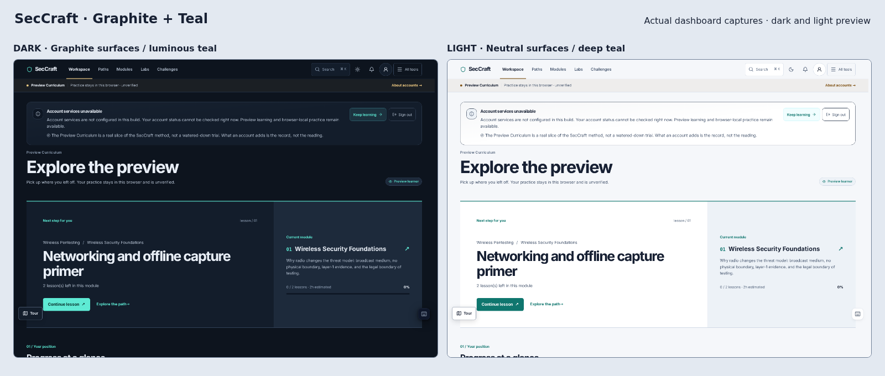

# Graphite + Teal — approved color pilot

Implemented 2026-10-01 after approval of Direction A. This is the shared theme foundation and a representative-screen pilot, **not a claim that all legacy color utilities have been migrated**.

The preview uses real Chromium dashboard screenshots, cropped to the upper page. The API-unavailable notice is an offline QA state, not fictional learning data.

## Changes

- Neutral graphite canvas and layered slate panels in dark mode; neutral off-white canvas and white panels in light mode.
- Slate text hierarchy replaces the previous green-tinted text. Pale teal is reserved for dark-theme actions; light-theme actions use deep teal and white text.
- Separate primary-action default/hover/pressed, link, control-outline, focus and semantic-status tokens. Shared controls and lesson primary actions use explicit state colors instead of brightness filters.
- Functional outlines are separate from decorative separators. The light control outline is `#718198`, darker than the initial proposal, to retain at least 3:1 against both the white panel and inset surface. Decorative dividers deliberately remain quieter.
- Success/warning/error notice surfaces have theme-specific fills; information and protocol labels have an independent blue role. Labels/provenance semantics are unchanged.
- Lesson syntax highlighting uses theme-aware foregrounds on a theme-aware code surface. The intentional dark terminal palette is unchanged.
- Browser chrome theme-color follows the actual new canvas.

Source of truth: `frontend/src/styles/workspace.css` (tokens) and `frontend/src/styles/color-system.css` (pilot state adoption). The latter loads after existing component styles, without deleting the legacy light-mode remapping rules prematurely.

## Validation

- Production build passed; **33 frontend tests passed**.
- Added token-pair regression coverage: main/secondary/muted/link text against all core surfaces; primary button default/hover/pressed; focus and functional borders; status foreground/fill pairs. Text threshold 4.5:1; required non-text boundaries 3:1.
- **32 Chromium route/width/theme checks**: public home, dashboard, wireless lesson theory, exact wireless lab/inspector, feedback, reports, settings and owner gate; 320/1440, dark/light. Final scan: no detected page overflow, uncaught page exceptions or axe violations.
- **4 populated owner-inbox fixture checks**: 320/1440, dark/light, including stale-save feedback. Passed geometry and axe checks. This is not a live authenticated-provider test.
- Added and ran `scripts/ui-color-states-smoke.mjs`: rendered primary default/hover/pressed, input border/focus, error notice and selected reporting view passed in both themes.
- Browser findings corrected: opacity-reduced lesson-action text and a teal-on-tinted protocol badge in light mode.
- Inspected actual dashboard screenshots in both themes. The browser runner can capture every visited route with `UI_AUDIT_SCREENSHOTS=1`.
- Lint: zero errors, 78 warnings. `git diff --check` passed.

CI is configured to include the lesson/lab routes and color-state smoke check. GitHub-hosted execution is still pending. These checks do not establish comprehensive WCAG conformance or real-device compatibility.

## Follow-up scope

1. Review this visual direction before expanding component-by-component migration of the legacy-color inventory.
2. Audit remaining diagrams, analytics/chart series, dialogs and non-default tool states; do not assume the new base tokens fix their hard-coded colors.
3. Remove old utility remapping only when its consumers have been migrated and checked in both themes.
4. Continue real-device, assistive-technology, populated-data and high-contrast-preference validation.

## Follow-up

The remaining source-color migration and expanded rendered checks were completed on 2026-10-01. See [full-platform audit and results](color-system-full-audit.md).
